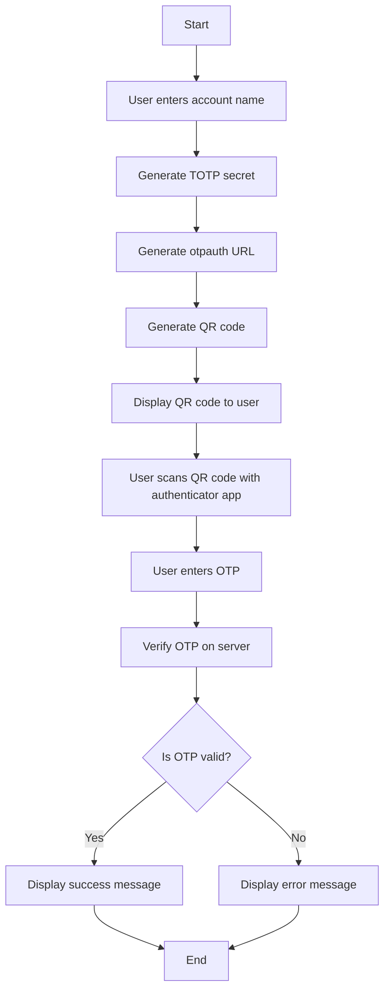

# 🚀 2Auth-JS: Two-Factor Authentication Implementation

A **secure** and **user-friendly** Node.js ,express.js application for implementing Two-Factor Authentication (2FA) using **TOTP** (Time-based One-Time Password) with QR code generation.

---

## 📑 Table of Contents

- [✨ Features](#-features)
- [⚙️ Prerequisites](#️-prerequisites)
- [📥 Installation](#-installation)
- [🛠️ Usage](#️-usage)
- [📂 Project Structure](#-project-structure)
- [🔗 API Endpoints](#-api-endpoints)
- [📘 Detailed Explanation](#-detailed-explanation)
- [⚙️ Options and Configurations](#️-options-and-configurations)
- [🛠️ Flowchart](#-Flowchart)
- [📜 License](#-license)

---

## ✨ Features

| Feature                              | Description                                     |
|--------------------------------------|-------------------------------------------------|
| 🖥️ **User-Friendly Interface**          | Simple and intuitive UI for setting up 2FA.    |
| 🔒 **Secure TOTP Generation**           | Uses `otplib` for secure time-based OTPs.      |
| 📱 **QR Code Generation**               | Generates QR codes for easy setup.             |
| ✅ **Server-Side Validation**           | Ensures OTPs are validated securely.           |
| ⚙️ **Customizable**                     | Fully configurable for various use cases.      |

---

## ⚙️ Prerequisites

Before you begin, ensure you have the following installed on your system:

- **Node.js** (v12 or higher)
- **NPM** or **Yarn**
- A **modern web browser**

---

## 📥 Installation

Follow these steps to set up the project:

1. **Clone the repository**

   ```bash
   git clone https://github.com/yourusername/2Auth-JS.git
   cd 2Auth-JS
   ```

2. **Install dependencies**

   ```bash
   npm install
   # or
   yarn install
   ```

3. **Start the application**

   ```bash
   npm start
   # or
   yarn start
   ```

4. **Access the application**

   Open your web browser and navigate to: `http://localhost:3000`

---

## 🛠️ Usage

| Step                        | Action                                                      |
|-----------------------------|------------------------------------------------------------|
| 🖋️ **Enter Account Name**      | Input your username or email.                              |
| 📷 **Scan QR Code**            | Use an authenticator app to scan the generated QR code.    |
| 🔢 **Enter OTP**               | Type the 6-digit OTP displayed in your app.                |
| 🛡️ **Verification**            | Application verifies OTP and shows success or failure.     |

---

## 📂 Project Structure

```
2Auth-JS/
├── public/
│   ├── index.html
│   ├── styles.css
│   └── script.js
├── server.js
├── package.json
└── README.md
```

---

## 🔗 API Endpoints

| Endpoint          | Description                         |
|-------------------|-------------------------------------|
| `GET /`          | Serves the main HTML page.          |
| `POST /set-account` | Sets up the account and QR code.   |
| `POST /verify`    | Verifies the OTP.                  |

---

## 📘 Detailed Explanation

This section provides a comprehensive breakdown of the project:

### Server-Side (`server.js`)

- **Express Setup**: Configures an Express application to handle routes and middleware.
- **Session Management**: Uses temporary server-side storage (e.g., session variables).
- **Routes**:
  - `GET /`: Serves the static homepage.
  - `POST /set-account`: Generates a QR code for the user.
  - `POST /verify`: Validates the entered OTP.

### Client-Side (`script.js`)

- **Account Setup**: Handles user input for account name.
- **OTP Input Handling**: Manages OTP fields for smooth user experience.
- **QR Code Generation**: Displays QR code for authenticator app setup.
- **Feedback**: Displays success or failure messages based on OTP validation.

---

## ⚙️ Options and Configurations

- **Port Configuration**: Change the port in `server.js`.
- **Session Management**: Upgrade to a database-backed session store for production.
- **Custom Styling**: Edit `styles.css` for a personalized design.
- **Security Enhancements**:
  - Use HTTPS in production.
  - Add rate-limiting to prevent brute-force attacks.

---

## 🛠️ Flowchart




## 📜 License

This project is licensed under the **[MIT License](LICENSE)**.

---

### 🤝 Contributing

Feel free to contribute by opening issues or submitting pull requests.

---

### 📞 Contact

- **Author**: AmirhosseinDehghanazar
- **Email**: a.dehghanazar@gmail.com
- **GitHub**: [AmirhosseinDehghanazar](https://github.com/AmirhosseinDehghanazar)

---

*This README provides a comprehensive guide on setting up and using the 2Auth-JS application. It is designed for developers of all levels, with clear instructions and visual aids.*
